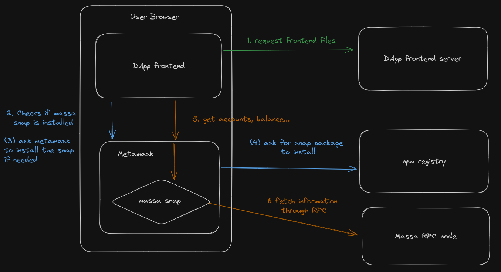

# Development instructions
This file contains the instructions to launch the project in a development environment.

## Warning : @massalabs/massa-web3
This package is used by the snap package but due to the security restrictions (checkout secure ECMAscript), the axios package is conflicting during the runtime.
The patch we found during the development was to manually change the code in the library to use the native fetch function.
This will need to be patched by the core-team in order to deploy the app in production mode.

Here is the content you should update in `node_modules/@massalabs/massa-web3/dist/{cmd, esm}/web3/BaseClient.js`:

```diff
-  4 import axios from 'axios'

...

  16 export const requestHeaders = {
  17     Accept: 'application/json,text/html,application/xhtml+xml,application/ xml;q=0.9,*/*;q=0.8',
  18     'Access-Control-Allow-Origin': '*',
  19     'Access-Control-Allow-Credentials': true,
  20     'Access-Control-Allow-Methods': 'GET,PUT,POST,DELETE,PATCH,OPTIONS',
  21 };
+ 22 export const fetchRequestHeaders = [
+ 23   ['Accept', 'application/json,text/html,application/xhtml+xml,application/xml;q=0.9,*/*;q=0.8'],
+ 24   ['Content-Type', 'application/json'],
+ 25 ]
  26 export const PERIOD_OFFSET = 5;

...

  160 try {
- 161     resp = await axios_1.default.post(this.getProviderForRpcMethod(resource).url, body, exports.requestHeaders);
- 162 }
+ 161     resp = await fetch(this.getProviderForRpcMethod(resource).url, {
+ 162         headers: fetchRequestHeaders,
+ 163         body: JSON.stringify(body),
+ 164         method: 'POST',
+ 165     });
+ 166 }

...

- 170 const responseData = resp.data;
+ 170 const responseData = await resp.json();
```

## Prerequisites
### Metamask Flask
Install the metamask flask in your favorite browser. Note that you should disable completely the regular version of metamask in order to get the flask one working.
Follow the setup prompt if any until you are on the homepage of the extension

### Install packages
Run a `yarn install` command at the root of the repository


## Start the app and snap server
Run `yarn run start` at the root of the repository and wait for both packages to start

## Visit the app
You can now head to `http://localhost:8000` to checkout the app.
You will be able to connect using the button on the top right and check your wallet information using the dashboard.
Note that the network has to be chosen on the top right too to execute transactions on the devnet.

## Test the snap
Once the installation ran, you have to build with `yarn build` and then you can run the tests with `yarn test`

# Project architecture

The following schema defines the architecture and the different parts of the project:

